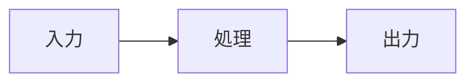

# 📋 実装計画PR（type:requirements）

> **用途**: Phase 1-5 統合要件定義・実装計画
> **推奨CI**: `ci:skip`（コード変更なし）
> **参照**: [開発標準Wiki](https://github.com/PROLE-ISLAND/.github/wiki)

---

## 0. メタ情報

| 項目 | 値 |
|------|-----|
| REQ ID | REQ-{Issue番号}: {機能名} |
| Issue Link | closes #{Issue番号} |
| 作成日 | YYYY-MM-DD |
| 作成者 | @username |
| ステータス | Draft / Review / Approved |

---

## 1. 調査レポート ⚠️ 必須

> `/investigate` で作成した調査レポートへのリンク
> 📚 [調査スキル活用ガイド](https://github.com/PROLE-ISLAND/.github/wiki/調査スキル活用ガイド)

**調査レポートリンク**: [Investigation Report](link-to-report)

### Investigation Report v1 要約

| 項目 | 内容 |
|------|------|
| 既存システム名 | |
| エントリーポイント | UI: / API: / CLI: |
| 主要データモデル | |
| キーファイル（3-10） | |
| 拡張ポイント | |
| 破壊ポイント | |
| やりたいこと（1行） | |

---

## 2. Phase 2: 要件定義・ユースケース ⚠️ 必須

> 📚 [要件定義テンプレート](https://github.com/PROLE-ISLAND/.github/wiki/要件定義テンプレート)
> 📚 [網羅性証明設計ガイド](https://github.com/PROLE-ISLAND/.github/wiki/網羅性証明設計ガイド)

### 2.1 機能概要

| 項目 | 内容 |
|------|------|
| **なぜ必要か（Why）** | |
| **誰が使うか（Who）** | |
| **何を達成するか（What）** | |

### 2.2 ユースケース定義（Role × Outcome）

> UC-ID命名規則: `UC-{DOMAIN}-{ROLE}-{OUTCOME}-{CHANNEL}`
> 例: `UC-HY-ADMIN-CANDIDATE_REGISTERED-WEB`

| UC-ID | Role | Outcome | Channel | 説明 |
|-------|------|---------|---------|------|
| UC-{DOMAIN}-{ROLE}-{OUTCOME}-{CHANNEL} | | | WEB/API/EMAIL | |

### 2.3 Role × Value マトリクス

| Role | 提供する価値 | 受け取る価値 | 関連Outcome |
|------|-------------|-------------|-------------|
| Admin | | | |
| User | | | |
| System | | — | |

### 2.4 カバレッジマトリクス（MECE証明）

> **空白セル禁止**: ✅ Gold E2E / 🟡 Bronze/Silver / — 対象外（理由必須）

| Role＼Outcome | Outcome1 | Outcome2 | Outcome3 |
|---------------|----------|----------|----------|
| Admin | | | |
| User | | | |

### 2.5 バリューフローマップ



### 2.6 入力ソースチェックリスト

**必須:**
- [ ] FEATURES.md または機能一覧
- [ ] ルーティング定義（app/ディレクトリ構造）
- [ ] データベーススキーマ（主要テーブル）

**推奨:**
- [ ] APIエンドポイント一覧
- [ ] ユーザーストーリー / PRD
- [ ] 画面キャプチャ / デザインファイル

---

## 3. Phase 3: 品質基準 ⚠️ 必須

> 📚 [DoD基準](https://github.com/PROLE-ISLAND/.github/blob/main/DoD_STANDARDS.md)

### 3.1 DoD Level 選択

- [ ] Bronze (27観点: 80%カバレッジ)
- [ ] Silver (31観点: 85%カバレッジ) ← 推奨
- [ ] Gold (19観点: 95%カバレッジ)

**選定理由**:

### 3.2 Pre-mortem（失敗シナリオ） ⚠️ 3つ以上必須

> 実装前に失敗原因を特定し、対策を立てる

| # | 失敗シナリオ | 発生確率 | 対策 | 確認方法 |
|---|-------------|---------|------|---------|
| 1 | | 高/中/低 | | |
| 2 | | 高/中/低 | | |
| 3 | | 高/中/低 | | |

---

## 4. Phase 4: 技術設計 ⚠️ 必須

> 📚 [開発標準](https://github.com/PROLE-ISLAND/.github/wiki/開発標準)
> 📚 [UI生成・レビューガイド](https://github.com/PROLE-ISLAND/.github/wiki/UI生成・レビューガイド)

### 4.1 データベース設計

**新規テーブル:**

| テーブル名 | 用途 | RLSポリシー |
|-----------|------|------------|
| | | |

<details>
<summary>📝 SQL詳細（クリックで展開）</summary>

```sql
-- テーブル定義
CREATE TABLE xxx (
    id UUID PRIMARY KEY DEFAULT gen_random_uuid(),
    organization_id UUID NOT NULL REFERENCES organizations(id),
    -- カラム定義
    created_at TIMESTAMPTZ DEFAULT NOW(),
    updated_at TIMESTAMPTZ DEFAULT NOW(),
    deleted_at TIMESTAMPTZ  -- ソフトデリート
);

-- RLS有効化
ALTER TABLE xxx ENABLE ROW LEVEL SECURITY;

-- RLSポリシー
CREATE POLICY "組織内のみ参照可能" ON xxx
    FOR SELECT USING (organization_id = auth.jwt()->>'organization_id');

-- インデックス
CREATE INDEX idx_xxx_organization ON xxx(organization_id);
```

</details>

**既存テーブル変更:**

| テーブル名 | 変更内容 | マイグレーション |
|-----------|---------|-----------------|
| | | |

### 4.2 API設計

| Method | Path | 説明 | 認証 |
|--------|------|------|------|
| POST | /api/xxx | | 必要 |

**Request/Response型定義:**

```typescript
// Request
interface XXXRequest {
}

// Response
interface XXXResponse {
}

// Zod Schema
const xxxSchema = z.object({
});

// Error Response
interface ErrorResponse {
  error: string;
  details?: Record<string, string[]>;
}
```

### 4.3 UI設計（UI機能の場合）

| 項目 | 値 |
|------|-----|
| **v0 Link** | |
| **Preview URL** | |
| **Feature Flag** | |

<details>
<summary>📝 Feature Flags定義例（クリックで展開）</summary>

```typescript
// lib/flags.ts
export const xxxDesignVariant = flag<'a' | 'b' | 'c'>({
  key: 'xxx-design-variant',
  defaultValue: 'a',
  options: [
    { value: 'a', label: 'パターンA' },
    { value: 'b', label: 'パターンB' },
    { value: 'c', label: 'パターンC' },
  ],
});
```

</details>

**画面一覧:**

| 画面名 | パス | バリアント | data-testid |
|--------|------|-----------|-------------|
| | | Default/Loading/Empty/Error | |

**コンポーネント一覧:**

| コンポーネント | 用途 | shadcn/ui ベース |
|--------------|------|-----------------|
| | | |

**バリアント実装チェック:**
- [ ] ⚫ Default - 正常データ表示
- [ ] ⚫ Loading - スケルトンUI
- [ ] ⚫ Empty - データなし状態
- [ ] ⚫ Error - エラー + 再試行ボタン

**Vercel Toolbar レビュー項目:**
- [ ] 全バリアントをFlags Explorerで確認
- [ ] a11y監査パス
- [ ] CLS問題なし
- [ ] INP（Interaction to Next Paint）が許容範囲内

### 4.4 変更ファイル一覧

| ファイルパス | 変更種別 | 概要 |
|-------------|---------|------|
| `src/...` | 新規/修正/削除 | |

---

## 5. Phase 5: テスト設計 ⚠️ 必須

> 📚 [Goldテストチャーター](https://github.com/PROLE-ISLAND/.github/wiki/Goldテストチャーター)
> 📚 [網羅性証明設計ガイド](https://github.com/PROLE-ISLAND/.github/wiki/網羅性証明設計ガイド)

### 5.1 Gold E2E候補評価（5つのレンズ）

> 全て「はい」の場合のみGold E2E対象

| レンズ | 質問 | 回答 |
|--------|------|------|
| ビジネスインパクト | 壊れたら売上/顧客体験に直接影響するか？ | はい/いいえ |
| 行動フォーカス | 実装ではなくユーザー目標を検証しているか？ | はい/いいえ |
| 欺瞞耐性 | モック/スタブでは通過できないか？ | はい/いいえ |
| 明確な失敗説明 | 失敗理由を1文で説明できるか？ | はい/いいえ |
| リスク明示 | このテストがないと何を犠牲にするか説明できるか？ | はい/いいえ |

### 5.2 トリアージスコアリング（Gold候補のみ）

> 16-20点 = Gold E2E必須

| 軸 | 評価（1-5） | 理由 |
|----|-----------|------|
| 売上/顧客体験への影響 | | |
| 使用頻度 | | |
| 検出難易度 | | |
| 復旧コスト | | |
| **合計** | /20 | |

### 5.3 GWT仕様（Gold E2E対象の場合）

```gherkin
Feature: {機能名}

  Scenario: {シナリオ名}
    Given {前提条件}
    When {操作}
    Then {期待結果}
```

**Playwright実装マッピング:**

| GWT | Playwrightコード |
|-----|-----------------|
| Given | |
| When | |
| Then | |

### 5.4 単体テスト設計

| 対象関数 | 正常系 | 異常系 | 境界値 |
|---------|--------|--------|--------|
| | | | |

### 5.5 トレーサビリティマトリクス

| UC-ID | GS-ID | Playwright ファイル | CIステージ |
|-------|-------|-------------------|-----------|
| | | | |

### 5.6 Gold実装チェックリスト

- [ ] ハードコードされたシークレットなし
- [ ] data-testidベースのセレクタのみ
- [ ] ローカルテスト成功
- [ ] CI/GitHub Actions E2E通過

---

## 6. 受け入れ条件 ⚠️ 必須

> この実装計画が「完了」とみなされる条件

- [ ]
- [ ]
- [ ]

---

## 7. 依存関係（任意）

**先行（このPRの前提）:**
-

**後続（このPRに依存）:**
-

**マージ順序（Stacked PR）:**
<!-- 例: #100 (DB) → #101 (API) → #102 (UI) → #103 (E2E) -->

---

## 8. 承認・サインオフ

| 役割 | 担当者 | 承認日 | ステータス |
|------|--------|--------|-----------|
| 作成者 | | | Draft |
| レビュアー | | | Pending |
| 承認者 | | | Pending |

---

## チェックリスト（PR作成前確認）

### Phase 1
- [ ] 調査レポートがリンクされている
- [ ] Investigation Report v1 要約が記入されている

### Phase 2
- [ ] ユースケースがRole × Outcomeで定義されている
- [ ] UC-IDが命名規則に従っている
- [ ] カバレッジマトリクスに空白セルがない
- [ ] バリューフローマップが作成されている

### Phase 3
- [ ] DoD Levelが選択・理由記載されている
- [ ] Pre-mortemで3つ以上の失敗シナリオが特定されている

### Phase 4
- [ ] DBスキーマがRLS付きで定義されている
- [ ] APIエンドポイントがZodスキーマ付きで定義されている
- [ ] UIモックが作成されている（UI機能の場合）
- [ ] data-testidが命名されている
- [ ] 変更ファイル一覧が記載されている

### Phase 5
- [ ] Gold E2E 5つのレンズ評価が完了している
- [ ] トリアージスコアリングが完了している（Gold候補）
- [ ] GWT仕様が作成されている（Gold対象）
- [ ] トレーサビリティが定義されている
- [ ] 実装チェックリストが確認されている

### 共通
- [ ] **コード変更は含まれていない**（ドキュメントのみ）

---

## 更新履歴

| 日付 | 内容 | 更新者 |
|-----|------|--------|
| YYYY-MM-DD | 初版作成 | @username |

<!--
📝 このPRは実装計画の合意形成が目的です。
承認後、このPRをベースに実装PRを作成してください。
ファイル保存先: docs/requirements/REQ-{issue番号}.md
-->
