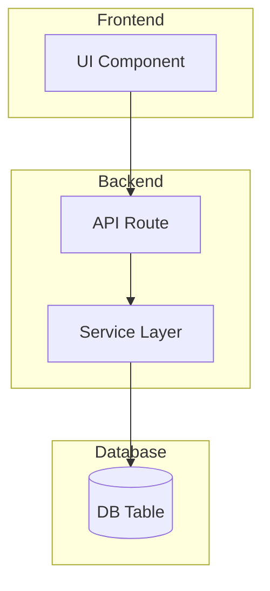
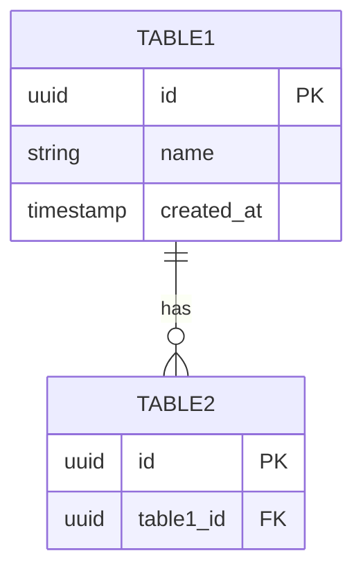
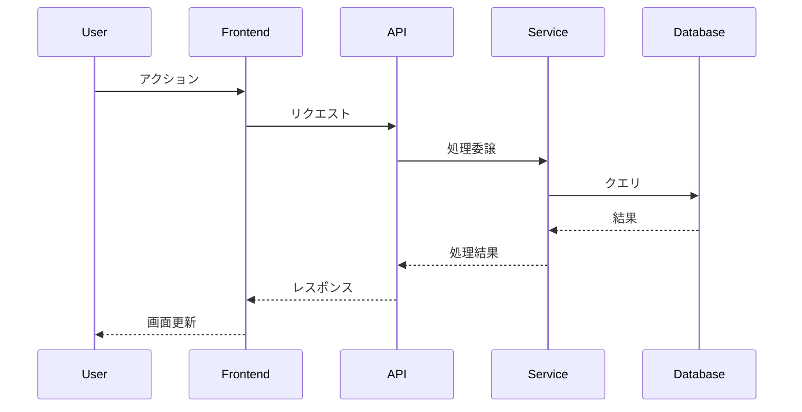

# {システム名} v{バージョン}

**ドメイン**: {ドメイン名}
**ステータス**: Active / Deprecated / Planning
**最終更新**: YYYY-MM-DD
**担当者**: @username

---

## 1. 概要

### 1.1 目的

<!-- このシステムの目的を1-3文で -->

### 1.2 ユーザー

<!-- このシステムを使用するユーザー種別 -->

| Role | 説明 |
|------|------|
| | |

### 1.3 主要機能

<!-- 主要機能の一覧 -->

- [ ] 機能1
- [ ] 機能2
- [ ] 機能3

---

## 2. アーキテクチャ

### 2.1 システム構成図



### 2.2 技術スタック

| レイヤー | 技術 |
|---------|------|
| Frontend | |
| Backend | |
| Database | |

---

## 3. エントリーポイント

### 3.1 UI

| パス | コンポーネント | 説明 |
|------|--------------|------|
| /xxx | `XxxPage.tsx` | |

### 3.2 API

| Method | Path | 説明 | 認証 |
|--------|------|------|------|
| GET | /api/xxx | | Required |
| POST | /api/xxx | | Required |

### 3.3 CLI / その他

| コマンド | 説明 |
|---------|------|
| npm run xxx | |

---

## 4. データモデル

### 4.1 主要テーブル

| テーブル | 説明 | 主要カラム |
|---------|------|-----------|
| | | |

### 4.2 ER図



### 4.3 主要な型定義

```typescript
interface XxxModel {
  id: string;
  name: string;
  createdAt: Date;
}
```

---

## 5. 主要ファイル

| ファイル | 役割 | 重要度 |
|---------|------|--------|
| src/xxx/index.ts | エントリーポイント | High |
| src/xxx/service.ts | ビジネスロジック | High |
| src/xxx/types.ts | 型定義 | Medium |
| src/xxx/utils.ts | ユーティリティ | Low |

---

## 6. ビジネスロジック

### 6.1 処理フロー



### 6.2 重要なビジネスルール

<!-- このシステム固有のビジネスルールを記載 -->

| ルール | 説明 | 実装箇所 |
|--------|------|---------|
| | | |

---

## 7. 拡張ポイント

### 7.1 新機能を追加する場合

<!-- どこにコードを追加すればよいか -->

| 拡張種別 | 追加場所 | 説明 |
|---------|---------|------|
| 新規評価軸 | src/xxx/evaluators/ | 新規ファイル追加 |
| APIエンドポイント | src/app/api/xxx/ | 既存ファイル修正 or 新規追加 |
| UI画面 | src/app/xxx/ | 新規ページ追加 |

### 7.2 拡張時の注意点

<!-- 拡張時に気をつけるべきこと -->

- [ ] 注意点1
- [ ] 注意点2

---

## 8. 破壊ポイント

### 8.1 変更時に影響を受ける箇所

<!-- 変更すると壊れる可能性がある箇所 -->

| 変更箇所 | 影響を受ける箇所 | リスク | 対策 |
|---------|----------------|--------|------|
| | | High/Med/Low | |

### 8.2 テストカバレッジ

| ファイル | カバレッジ | 優先度 |
|---------|-----------|--------|
| | | |

---

## 9. 設定・環境変数

| 変数名 | 説明 | 必須 | デフォルト |
|--------|------|------|-----------|
| | | Yes/No | |

---

## 10. 関連ドキュメント

- [関連Issue](#)
- [設計ADR](#)
- [API仕様書](#)

---

## 11. 更新履歴

| 日付 | バージョン | 内容 | 更新者 |
|-----|-----------|------|--------|
| YYYY-MM-DD | v1.0 | 初版作成 | @username |
